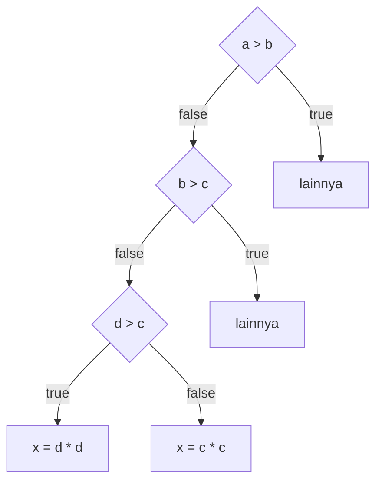

## soal 26

Perhatikan program di bawah ini

```cpp
int main() {
int a, b, c, d, x;
  cin >>a>>b>>c>>d;
  a = a + a;
  b = a + b;
  c = a + b + c;
  d = a + b + c + d;
  x = a + b + c + d;
  cout << x;
  return 0;
}
```

Jika program tersebut dijalankan dengan masukan `1 2 3 5` berapakah nilai `x` yang
akan dicetak?

<details><summary>Solusi</summary>

Dari masukan `1 2 3 4 5`,
nilai dari `a = 1, b = 2, c = 3, d = 5`.

Diperoleh dari statement `cin >>a>>b>>c>>d;`. Statement berikutnya dapat dilihat pada tabel dibawah

| statement           | a   | b   | c   | d   | x      |
| ------------------- | --- | --- | --- | --- | ------ |
| `cin >>a>>b>>c>>d;` | 1   | 2   | 3   | 5   | `null` |
| `a = a + a`         | 2   | 2   | 3   | 5   | `null` |
| `b = a + b`         | 2   | 4   | 3   | 5   | `null` |
| `c = a + b + c`     | 2   | 4   | 9   | 5   | `null` |
| `d = a + b + c + d` | 2   | 4   | 9   | 20  | `null` |
| `x = a + b + c + d` | 2   | 4   | 9   | 20  | 35     |

Nilai `x` yang akan dicetak adalah 35

</details>

## Soal 27

Perhatikan potongan program berikut!

```cpp
if (a > b) {
  if (a > c) {
    if (d > a) {
      x = d * d;
    } else {
      x = a * a;
    }
  } else {
    if (d > c) {
      x = d * d;
    } else {
      x = c * c;
    }
  }
} else {
  if (b > c) {
    if (d > b) {
      x = d * d;
    } else {
      x = b * b;
    }
  } else {
    if (d > c) {
      x = d * d;
    } else {
      x = c * c;
    }
  }
}
```

Jika nilai `a=12`, `b=23`, `c=45`, dan `d=78`, berapakah nilai dari `x` setelah potongan
program tersebut dijalankan?

<details><summary>Solusi</summary>

dari nilai yang diterima, `a > b == false`, `b > c == false`, dan `d > c == true`

Flowchart dari program diatas dapat dilihat pada diagram dibawah:



karena `d > c == true`, statement yang dijalankan adalah `x = d * d`. Sehingga nilai `x` setelah dijalankan adalah `78 * 78 = 6084`

</details>

## Soal 28

Perhatikan potongan program berikut:

```cpp
for (int i = 0; i < m; i++) {
  if (i % 2 == 0)
    for (int j = 0; j < i; j++)
      cout << ”*”;
  else
    for (int j = 0; j < n; j++)
      cout << ”*”;
}
```

Berapa banyak karakter bintang (`*`) akan tercetak jika diberikan nilai `m = 30` dan `n = 10`

<details><summary>Solusi</summary>

Perhatikan tabel dibawah:

| `i`     | `i % 2 == 0` | `for (int j = 0; j < i; j++)`    | `for (int j = 0; j < n; j++)`    |
| ------- | ------------ | -------------------------------- | -------------------------------- |
| 0       | `true`       | 0 karakter `*`                   | tidak dieksekusi, 0 karakter `*` |
| 1       | `false`      | tidak dieksekusi, 0 karakter `*` | 10 karakter `*`                  |
| 2       | `true`       | 2 karakter `*`                   | tidak dieksekusi, 0 karakter `*` |
| 3       | `false`      | tidak dieksekusi, 0 karakter `*` | 10 karakter `*`                  |
| 4       | `true`       | 4 karakter `*`                   | tidak dieksekusi, 0 karakter `*` |
| $\dots$ | $\dots$      | $\dots$                          | $\dots$                          |
| 28      | `true`       | 28 karakter `*`                  | tidak dieksekusi, 0 karakter `*` |
| 29      | `false`      | tidak dieksekusi, 0 karakter `*` | 10 karakter `*`                  |

Statement `for (int j = 0; j < n; j++)` dieksekusi sebanyak 15 kali sehingga dicetak $15\times 10 = 150$ karakter `*` oleh statement ini.

statement `for (int j = 0; j < i; j++)` mencetak `*` dalam bentuk barisan bilangan genap. Banyak `*` yang dicetak ada $0+2+4+6+\dots+28=210$ karakter `*`

Jadi, banyaknya karakter `*` yang dicetak adalah $150+210=360$ karakter `*`

</details>

## Soal 29

Perhatikan potongan program berikut:

```cpp
int x = 0;
int y = 0;
while (x * 7 < 986 && y * 4 <= 876 && x - y > -67) {
  x += 2;
  y += 3;
}
```

Berapa nilai akhir dari `y` setelah potongan program di atas dijalankan?

<details><summary>Solusi</summary>

`x * 7 < 986` akan bernilai `false` saat `x > 140`

`y * 4 <= 876` akan bernilai `false` saat `y > 219`

`x` akan mencapai nilai 140 pada iterasi (pengulangan) ke-170, dan `y` akan mencapai nilai 219 pada iterasi ke-73

setiap iterasi, nilai `x - y` berkurang 1, sehingga `x - y > -67` akan bernilai `false` pada iterasi ke 67.

karena kondisi `x - y > -67` bernilai `false` lebih dahulu dicapai, loop hanya akan dijalankan sebanyak 67 kali. NIlai `y` diakhir loop adalah `3 * 67 == 201`

Jadi, nilai akhir dari `y` setelah program dijalankan adalah $201$

</details>

</details>

## Soal 30

Perhatikan potongan program berikut:

```cpp
int a[10] = {7, 4, 5, 0, 2, 3, 8, 1, 9, 6};
int sebelum = 0;
for (int i = 0; i < 10; i++) {
  sebelum += a[i];
}
a[a[a[a[a[a[a[7]]]]]]] = a[a[a[a[a[a[a[6]]]]]]];
int setelah = 0;
for (int i = 0; i < 10; i++) {
  setelah += a[i];
}
int ans = setelah - sebelum;
```

Berapa nilai `ans` setelah potongan program di atas dijalankan?

<details><summary>Solusi</summary>

Setelah menjalankan statement `for` yang pertama, nilai variable `sebelum` adalah penjumlahan dari isi array `a`.

Perhatikan bahwa

```
a[a[a[a[a[a[a[7]]]]]]] == a[a[a[a[a[a[1]]]]]]
a[a[a[a[a[a[a[7]]]]]]] == a[a[a[a[a[4]]]]]
a[a[a[a[a[a[a[7]]]]]]] == a[a[a[a[2]]]]
a[a[a[a[a[a[a[7]]]]]]] == a[a[a[5]]]
a[a[a[a[a[a[a[7]]]]]]] == a[a[3]]
a[a[a[a[a[a[a[7]]]]]]] == a[0]
```

dan

```
a[a[a[a[a[a[a[6]]]]]]] == a[a[a[a[a[a[8]]]]]]
a[a[a[a[a[a[a[6]]]]]]] == a[a[a[a[a[9]]]]]
a[a[a[a[a[a[a[6]]]]]]] == a[a[a[a[6]]]]
a[a[a[a[a[a[a[6]]]]]]] == a[a[a[8]]]
a[a[a[a[a[a[a[6]]]]]]] == a[a[9]]
a[a[a[a[a[a[a[6]]]]]]] == a[6]
a[a[a[a[a[a[a[6]]]]]]] == 8
```

Jadi, pada statement `a[a[a[a[a[a[a[7]]]]]]] = a[a[a[a[a[a[a[6]]]]]]]`. nilai `a[0]` diisi dengan 8.

Sehingga `a == {8, 4, 5, 0, 2, 3, 8, 1, 9, 6}`

pada statement `for` yang kedua, varibale `setelah` adalah penjumlahan dari isi array `a` yang baru.

karena `int ans = setelah - sebelum`. Maka `ans` berisi nilai `a[0]` sebelum - `a[0]` setelah, karena hanya `a[0]` yang diubah. `ans == 8 - 7`

Jadi, nilai `ans` setelah program dijalankan adalah 1

</details>
