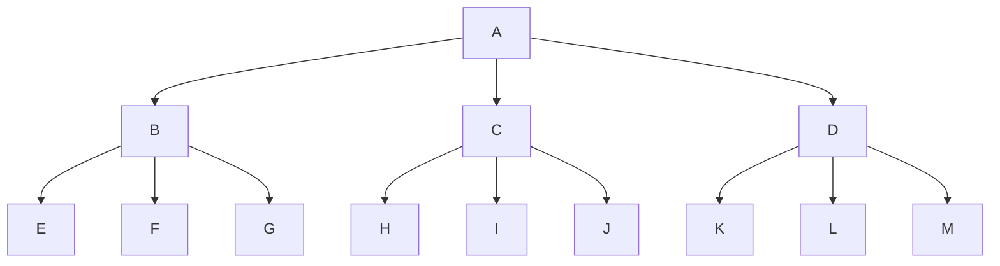

## Soal 21

Terdapat 60 petak yang dinomori dari 1 sampai 60. Petak-petak tersebut tersusun
secara melingkar sehingga untuk setiap $i$ $(1 \le i \le 59)$, petak i terletak di sebelah kiri
petak $i + 1$ dan petak 60 terletak di sebelah kiri petak 1. Tiga bebek Pak Dengklek yang
bernama Kwak, Kwik, dan Kwek akan bermain pada petak-petak tersebut. Awalnya,
mereka bertiga berada di petak 1. Dalam setiap detik, hal-hal berikut akan terjadi
secara bersamaan:

- Kwak melompat ke petak yang berada sejauh tepat 7 petak di kanannya.
- Kwik melompat ke petak yang berada sejauh tepat 43 petak di kanannya.
- Kwek melompat ke petak yang berada sejauh tepat 23 petak di kanannya.

Permainan dianggap selesai ketika ketiga bebek berada pada petak yang sama di saat
yang sama setelah mulai bergerak. Petak nomor berapakah ketiga bebek akan berada
saat permainan selesai?

## Soal 22

Pemerintah Kabupaten Algoria berniat untuk menghubungkan keenam kecamatannya
dengan jaringan Internet super cepat untuk meningkatkan perekonomian rakyatnya.
Jaringan tersebut akan dibangun dengan membuat kabel yang menghubungkan antar
kecamatan, sedemikian rupa sehingga antar setiap pasang kecamatan harus ada jalur
melalui kabel-kabel yang menghubungkan keduanya (baik secara langsung maupun
melalui kecamatan-kecamatan lain). Lebih lanjut, setiap kabel yang menghubungkan
dua buah kecamatan harus dibangun melalui jalan yang menghubungkan dua buah
kecamatan tersebut. Terdapat 9 jalan yang menghubungkan 6 kecamatan tersebut,
sebagaimana terlihat pada gambar di bawah ini.

```
TBD
```

Keenam kecamatan ditandai dengan nomor 0 sampai 5, sedangkan angka pada setiap
sisi jalan menunjukkan biaya yang diperlukan untuk memasang kabel pada sisi jalan
tersebut. Pak Dengklek yang ditugaskan untuk merencanakan pembangunan jaringan
Internet tersebut, telah menghitung bahwa biaya terkecil untuk menghubungkan
semua kecamatan adalah 12, sebagaimana ditunjukkan pada gambar di bawah ini.

```
tbd
```

Namun, ketika Pak Dengklek ingin mengusulkan rencana pembangunan jalan
sebagaimana terlihat pada gambar di atas, oleh atasannya rencana tersebut ditolak.
Lebih lanjut, sang atasan meminta pak Dengklek mencari berapakah biaya terkecil
kedua setelah nilai biaya terkecil (12) yang diusulkan Pak Dengklek tadi?

## Soal 23

Misal K adalah nilai terbesar sedemikian sehingga $(2023!)^{2023!}$ habis dibagi $42^K$. Berapa banyaknya digit 0 berurutan di akhir K?

## Soal 24

Pada suatu hari terjadi percakapan antara Kwak dan Kwik menggunakan bahasa
bebek:

- “Wak wiik woak” kata Kwak, yang artinya “hari ini belajar Matematika”.
- “Wak wan waik week wiik waok” kata Kwik, yang artinya kemarin juga belajar Matematika dan Informatika”.
- “Waik nwek wiik waok” kata Kwak meralat pernyataan Kwik, yang artinya “kemarin hanya belajar Informatika”.
- Kwok kemudian bertanya “Wak nwek wiik wook?” yang artinya “besok hanya belajar Matematika?”.

Jika Kwik akan menjawab bahwa “besok juga belajar Informatika”, apa yang akan diucapkan oleh Kwik?

## Soal 25

Pak Dengklek memiliki 13 buah benda pusaka yang dilabeli A, B, C, D, E, F, G, H, I, J, K, L, dan M dalam sebuah tanah yang masing-masing memiliki hubungan sebagai berikut:



Dari gambar di atas diketahui bahwa benda pusaka B, C, dan D memiliki kekuatan
yang diturunkan dari benda pusaka A, benda pusaka E, F, dan G memiliki kekuatan
yang diturunkan dari benda pusaka B, dst. Kemudian Pak Dengklek mendefinisikan
sebuah fungsi `kiri(X)`, `tengah(X)` dan `kanan(X)` suatu benda pusaka X yang
didefinisikan sebagai benda pusaka yang posisinya sebagai turunan benda pusaka X
sebelah kiri, tengah, dan kanan. Sebagai contoh `kiri(B)=E`, `tengah(B)=F`, `kanan(B)=G`,
tentunya benda pusaka yang tidak memiliki turunan, nilai fungsi kiri, tengah, dan
kananya akan bernilai kosong. Selanjutnya Pak Dengklek mendefinisikan sebuah cara
untuk mencari benda pusaka yang dia miliki yaitu dengan cara membuat fungsi cari
sebagai berikut:

```
fungsi cari(x):
  jika nilai x tidak kosong:
    cari(kiri(x));
    cari(tengah(x));
    cari(kanan(x));
    letakkan x dalam box;
```

Setiap kali menemukan benda pusaka, Pak Dengklek akan meletakkannya dalam
sebuah boks kosong pada posisi paling atas. Jika Pak Dengklek memulai pencarian
dengan benda pusaka A yaitu cari(A) sampai semua benda pusaka ditemukan,
tuliskan urutan benda pusaka dalam boks mulai dari posisi paling atas sampai posisi
paling bawah.
